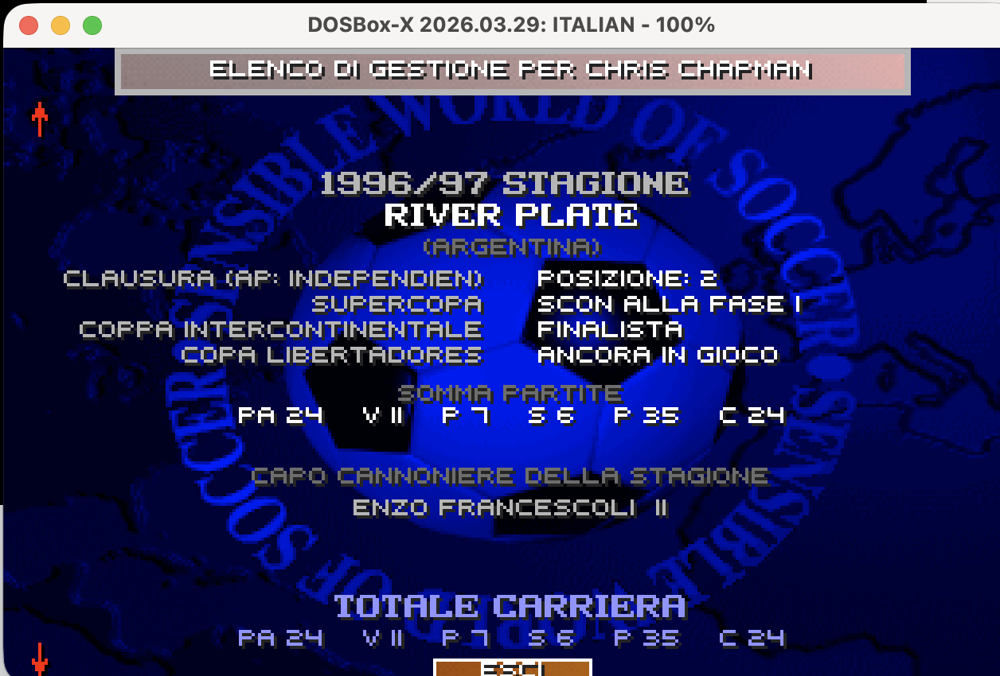

## English

**SWOS 96/97 Mod 2.5: Argentina's Apertura and Clausura, Australia, New Zealand and MLS 1997, as they were played**

### Argentina 1996-97: Apertura, Clausura, aggregate table and promedio

The Primera División had no 38-round league in 1996-97. It played two separate tournaments, and the mod now does the same.

- **Torneo Apertura and Torneo Clausura:** each season starts with the **APERTURA** (19 rounds). When it ends, the table is reset and the league becomes the **CLAUSURA** (19 rounds), in the calendar, the table and the management record.
- **The Apertura champion is kept.** The season record shows the Clausura with the Apertura champion in brackets, for example **"CLAUSURA (AP: INDEPENDIEN)"**. The text survives saving and loading.

  

- **Aggregate table for the South American cups:** the Copa Libertadores (1st and 2nd) and the Copa CONMEBOL (3rd to 5th) places of Argentina come from the **aggregate table**: Apertura + Clausura, 3 points for a win, goal difference as tie-break. The table you see at the end of the season is the Clausura's; the aggregate one is not shown, but it decides the qualifiers.
- **Relegation by "promedio",** as the AFA did it: the points (2 for a win, as in the AFA's own count) divided by the matches played over the last three seasons. The two worst averages go down, the two best clubs of the Nacional B come up. The 1994-95 and 1995-96 seasons are real (es.wikipedia) and the history is saved with the career, season after season. A club that played fewer Primera seasons counts only those; a promoted club starts from zero.
- **Declared approximation:** the Nacional B is a 20-club league with 2 promotions (in 1996-97 it had 32 clubs in zones and a "reducido").

### Australia: NSL 1996-97

- **14 clubs and 26 rounds,** as in 1996-97: Perth Glory (new) and Collingwood Warriors (Heidelberg United merged into them) join the league; Morwell Falcons are now Gippsland Falcons. No Australian club was removed: the other clubs play in the state divisions.
- **Real squads and coaches,** rebuilt from the line-ups of every round (players already in SWOS keep their ratings).
- **NSL Cup 1996-97:** 16 clubs with the real bracket and the two state select XIs (South Australian Reds, Northern NSW Lions); round of 16 over two legs, then single matches. Approximation: the golden goal of the time is replaced by normal extra time.
- **NSL Finals:** the top 4 play semi-finals over two legs (1st v 4th, 2nd v 3rd, away goals), then a single-match Grand Final. **The play-off winner is the champion** in the management record ("WINNERS"; a beaten club shows "FINALIST" or the round it reached). Declared approximation: the real finals series had 6 clubs and a "double chance" for the top two; that is planned for a future version.

### New Zealand: NSSL 1996-97

- **National Summer Soccer League:** the 10 real clubs, home and away (18 rounds), **4 points for a win**.
- **Penalties after every draw:** a drawn match goes straight to a shoot-out (no extra time). The result stays a draw (1 point each) and **the shoot-out winner gets 1 bonus point**, as in 1996-97. The game list shows "WIN x-y ON PENS"; the league-table screen shows only the draw.
- **NSSL Playoffs:** the top 4 play single-match semi-finals (1st v 4th, 2nd v 3rd), then the final; the winner is the champion in the record. Declared approximation: the real play-offs gave the top two a "double chance" (planned for a future version).
- **Regional leagues:** NORTHERN, CENTRAL and SOUTHERN, 10 clubs each: the 20 SWOS clubs plus 10 real 1996 clubs (Lynn-Avon United, Blockhouse Bay, Fencibles United, Ngaruawahia United, Papakura City, Western Suburbs, North Wellington, Gisborne City, Tararua United, Northern Hearts). Their squads are invented (no source exists). The NSSL clubs keep their SWOS squads (no 1996-97 squad source found).

### USA: MLS 1997

- **The 10 clubs of 1997** with real names (Columbus Crew, Kansas City Wizards, D.C. United), 1997 coaches and squads (the 16 players with most appearances; a player already in SWOS keeps his ratings).
- **No draws, as in MLS:** a drawn match goes to penalties; win 3 points, shoot-out win 1, loss 0. Approximation: penalties replace the 35-yard shoot-out of the time.
- **One table, 4 matches per pair (36):** the real season had 32 matches, two conferences and play-offs; these are not reproduced.

### Also

- **Management record:** the Supercopa and the Intercontinental Cup lines had no name; fixed.
- **A club missing from its national cup** (Perth Glory did not play the NSL Cup 1996-97) no longer freezes the end of the season.
- **New career recommended:** the team numbers of Bolivia and New Zealand moved. Saves of 2.0 still load.

### Thanks and sources

- Australia: the ozfootball.net archive (Thomas Esamie and the other authors), through the Wayback Machine: every NSL round, the finals series and the NSL Cup 1996-97, line-ups included; club season pages on Wikipedia.
- New Zealand: The Ultimate New Zealand Soccer Website by **Jeremy Ruane** (NSSL 1996-97, Northern, Central and Southern Leagues 1996), through the Wayback Machine; en.wikipedia "1996-97 National Summer Soccer League".
- MLS 1997: Transfermarkt (squad statistics), en.wikipedia "1997 Major League Soccer season".
- Argentina: es.wikipedia (Primera División 1994-95, 1995-96, 1996-97, Apertura and Clausura tables, promedios), RSSSF.

**If you are an author or you have better data, open an issue or write to us: we will correct or remove anything.**

### How to use

Download `swos-9697-mod-patcher.html`, open it in a browser and drop in your language's executable, `DATA\TEAM.020`, `TEAM.044`, `TEAM.062` and `TEAM.073` (CD or GOG version). Download the patched files and copy them into the game folder (the TEAM files into `DATA`) after backing it up. Start a new career.

Technical manual: [English](https://aminta.github.io/swos-9697-mod/) · [Italiano](https://aminta.github.io/swos-9697-mod/it.html)

---

## Italiano

**SWOS 96/97 Mod 2.5: Apertura e Clausura in Argentina, Australia, Nuova Zelanda e MLS 1997, come si giocarono**

### Argentina 1996-97: Apertura, Clausura, classifica complessiva e promedio

Nel 1996-97 la Primera División non aveva un campionato da 38 giornate. Si giocavano due tornei separati, e ora il mod fa lo stesso.

- **Torneo Apertura e Torneo Clausura:** ogni stagione comincia con l'**APERTURA** (19 giornate). Quando finisce, la classifica si azzera e il campionato diventa il **CLAUSURA** (19 giornate), nel calendario, nella classifica e nel registro di gestione.
- **Il campione dell'Apertura resta.** Il registro della stagione mostra il Clausura con il campione dell'Apertura tra parentesi, per esempio **"CLAUSURA (AP: INDEPENDIEN)"**. Il testo resta anche dopo salvataggio e caricamento.

  

- **Classifica complessiva per le coppe sudamericane:** i posti dell'Argentina in Copa Libertadores (1ª e 2ª) e in Copa CONMEBOL (dalla 3ª alla 5ª) vengono dalla **classifica complessiva**: Apertura + Clausura, 3 punti a vittoria, differenza reti in caso di parità. La classifica che vedi a fine stagione è quella del Clausura; quella complessiva non viene mostrata, ma decide le qualificate.
- **Retrocessioni col "promedio",** come faceva l'AFA: i punti (2 a vittoria, come nel conteggio dell'AFA) divisi per le partite giocate nelle ultime tre stagioni. Le due medie peggiori retrocedono, le prime due della Nacional B salgono. Le stagioni 1994-95 e 1995-96 sono reali (es.wikipedia) e lo storico viene salvato con la carriera, stagione dopo stagione. Un club che ha giocato meno stagioni in Primera conta solo quelle; una neopromossa parte da zero.
- **Approssimazione dichiarata:** la Nacional B è un campionato da 20 club con 2 promozioni (nel 1996-97 aveva 32 club divisi in zone e un "reducido").

### Australia: NSL 1996-97

- **14 club e 26 giornate,** come nel 1996-97: entrano il Perth Glory (nuovo) e i Collingwood Warriors (in cui confluì l'Heidelberg United); i Morwell Falcons diventano Gippsland Falcons. Nessun club australiano è stato tolto: gli altri giocano nei campionati statali.
- **Rose e allenatori reali,** ricostruiti dalle formazioni di ogni giornata (i giocatori già presenti in SWOS mantengono i loro valori).
- **NSL Cup 1996-97:** 16 club con il tabellone reale e le due rappresentative statali (South Australian Reds, Northern NSW Lions); ottavi con andata e ritorno, poi gare secche. Approssimazione: il golden goal dell'epoca è sostituito dai supplementari normali.
- **NSL Finals:** le prime 4 giocano le semifinali con andata e ritorno (1ª-4ª, 2ª-3ª, vale il gol in trasferta), poi la Grand Final in gara secca. **Il vincitore dei play-off è il campione** nel registro di gestione ("VINCITORI"; chi perde vede "FINALISTA" o "ALLE SEMI-FINALI"). Approssimazione dichiarata: le finali vere avevano 6 club e la "doppia possibilità" per le prime due; è prevista per una versione futura.

### Nuova Zelanda: NSSL 1996-97

- **National Summer Soccer League:** i 10 club reali, andata e ritorno (18 giornate), **4 punti a vittoria**.
- **Rigori dopo ogni pareggio:** una partita finita in parità va subito ai rigori (niente supplementari). Il risultato resta un pareggio (1 punto a testa) e **chi vince ai rigori prende 1 punto bonus**, come nel 1996-97. L'elenco partite mostra "VINCE x-y AI RIG."; la schermata della classifica mostra solo il pareggio.
- **NSSL Playoffs:** le prime 4 giocano le semifinali in gara secca (1ª-4ª, 2ª-3ª), poi la finale; il vincitore è il campione nel registro. Approssimazione dichiarata: i play-off veri davano alle prime due la "doppia possibilità" (prevista per una versione futura).
- **Campionati regionali:** NORTHERN, CENTRAL e SOUTHERN, 10 club ciascuno: i 20 club di SWOS più 10 club reali del 1996 (Lynn-Avon United, Blockhouse Bay, Fencibles United, Ngaruawahia United, Papakura City, Western Suburbs, North Wellington, Gisborne City, Tararua United, Northern Hearts). Le loro rose sono inventate (non esistono fonti). I club della NSSL mantengono le rose di SWOS (non abbiamo trovato fonti per le rose 1996-97).

### USA: MLS 1997

- **I 10 club del 1997** con i nomi veri (Columbus Crew, Kansas City Wizards, D.C. United), allenatori e rose del 1997 (i 16 giocatori con più presenze; chi era già in SWOS mantiene i suoi valori).
- **Niente pareggi, come in MLS:** una partita in parità va ai rigori; vittoria 3 punti, vittoria ai rigori 1, sconfitta 0. Approssimazione: i rigori sostituiscono lo shoot-out dalle 35 yard dell'epoca.
- **Classifica unica, 4 partite per coppia (36):** la stagione vera aveva 32 partite, due conference e i play-off, che non sono riprodotti.

### Inoltre

- **Registro di gestione:** le righe della Supercopa e della Coppa Intercontinentale erano senza nome; corretto.
- **Un club assente dalla sua coppa nazionale** (il Perth Glory non giocò la NSL Cup 1996-97) non blocca più la fine della stagione.
- **Consigliata una carriera nuova:** i numeri delle squadre di Bolivia e Nuova Zelanda sono cambiati. I salvataggi della 2.0 si caricano ancora.

### Ringraziamenti e fonti

- Australia: l'archivio di ozfootball.net (Thomas Esamie e gli altri autori), tramite la Wayback Machine: tutte le giornate della NSL, le finali e la NSL Cup 1996-97, formazioni comprese; pagine delle stagioni dei club su Wikipedia.
- Nuova Zelanda: The Ultimate New Zealand Soccer Website di **Jeremy Ruane** (NSSL 1996-97, Northern, Central e Southern League 1996), tramite la Wayback Machine; en.wikipedia "1996-97 National Summer Soccer League".
- MLS 1997: Transfermarkt (statistiche delle rose), en.wikipedia "1997 Major League Soccer season".
- Argentina: es.wikipedia (Primera División 1994-95, 1995-96, 1996-97, classifiche di Apertura e Clausura, promedios), RSSSF.

**Se sei un autore o hai dati migliori, apri una issue o scrivici: correggiamo o togliamo qualsiasi cosa.**

### Come si usa

Scarica `swos-9697-mod-patcher.html`, aprilo nel browser e trascina l'eseguibile della tua lingua, `DATA\TEAM.020`, `TEAM.044`, `TEAM.062` e `TEAM.073` (versione CD o GOG). Scarica i file modificati e copiali nella cartella del gioco (i file TEAM in `DATA`) dopo averne fatto una copia di sicurezza. Inizia una carriera nuova.

Manuale tecnico: [English](https://aminta.github.io/swos-9697-mod/) · [Italiano](https://aminta.github.io/swos-9697-mod/it.html)
